# CUBIST: Critique-guided Underrepresented-token Boosting for Inference-time Semantic Text-to-3D

**Project Report — Full Development History**
**Author:** Rohan | **Advisor:** Dr. Simon Stepputtis | Virginia Tech TEA Lab
**Target Venue:** WACV 2027, Round 2

---

## TL;DR

Text-to-3D models often drop or misrepresent details from the prompt (wrong colors, missing parts). **CUBIST** is a training-free fix: wrap the 3D generator in a loop where a vision-language model critiques the rendered result, figures out which prompt words got ignored, and boosts those specific words' influence on the next generation attempt.

The real story of this project isn't just the method, it's the debugging. The first scoring system used to detect what went wrong was quietly broken for months (it matched "cat" to "dog" as an acceptable answer), which meant every earlier result built on top of it was suspect. After rebuilding the scorer properly and fixing several real implementation bugs found through direct code review, the method was re-tested rigorously: across two independent 40-object batches, CUBIST beat simple random-seed resampling **82.5% and 85.0% of the time**, with results replicating almost perfectly between the two independent runs (39/40 objects agreed) and statistical significance around p ~ 10⁻⁹. A 63-person human study backed this up independently, with an 80.9% win rate for CUBIST over baseline.

---

  

<em>The full CUBIST pipeline: render → VLM critique → identify under-represented tokens → boost → regenerate.</em>

---

## 1. Overview and Motivation

Text-to-3D generation has become increasingly important for simulated environments, game asset creation, and embodied AI, where robots and agents need spatial understanding of objects before physical interaction. While image-to-3D pipelines have advanced rapidly, direct text-to-3D generation remains difficult because short text prompts are inherently underspecified — many valid 3D assets could satisfy the same prompt. As a result, generated assets frequently omit or misrepresent attributes the prompt explicitly specifies (wrong colors, missing parts, incorrect materials), creating a fidelity gap between what was asked for and what was generated.

**CUBIST** addresses this gap with a training-free, inference-time framework: a pretrained text-to-3D diffusion model is wrapped in an iterative vision-language-model (VLM) critic loop. At each round, the critic inspects rendered views of the current 3D asset, identifies which prompt tokens are under-represented in the output, and boosts those tokens' influence in the diffusion process for the next generation attempt — without any model retraining.

CUBIST is architecturally compatible with any flow-matching transformer that uses per-block cross-attention between the 3D latent and per-token prompt embeddings, which includes **TRELLIS** (Microsoft's text-to-3D system, the primary testbed), **TIGON** (a dual-branch DiT, Cen et al., CVPR 2026), and **Michelangelo**. Hunyuan3D and CraftsMan were evaluated as baselines but excluded from CUBIST integration proper, since they route through a text-to-image intermediate stage — by the time 3D generation begins, prompt tokens are no longer available to intervene on.

---

## 2. Related Work and Positioning

An early literature review (April 2026) was essential in correctly positioning CUBIST's contribution. Two mechanisms initially believed to be novel were found to have substantial prior art in the 2D text-to-image literature:

- **Timestep-aware phased token intervention** (structure/shape/detail phase splitting during denoising) connects to Prompt-to-Prompt (Hertz et al., 2022), ELLA's Timestep-Aware Semantic Connector (Hu et al., 2024), TASR, and T-GATE (Liu et al., 2024).
- **Iterative VLM-critic feedback** connects to Reflect-DiT (ICCV 2025), Divide-Evaluate-Refine (NeurIPS 2023), FABRIC (2023), and "Iterative Refinement Improves Compositional Image Generation."
- **Attend-and-Excite** (Chefer et al.) was identified as the most directly relevant precedent for the token-boosting mechanism specifically — their method strengthens the single most-neglected token's cross-attention activation at each timestep, using a gradual, ramped correction strength (0.05 to 0.5 to 0.8) rather than a single full-strength push, specifically to avoid pushing generation out of distribution.

This review reframed CUBIST's actual contribution: not the invention of phased intervention or iterative critique individually, but their combination and adaptation to the 3D domain, where no equivalent VLM-critic feedback loop existed for flow-matching text-to-3D generators.

---

## 3. Dataset and Experimental Infrastructure

### 3.1 Dataset selection

Establishing a defensible evaluation dataset required significant iteration. OmniObject3D, ABO, GSO, ModelNet40, and 3D-FUTURE were each evaluated and rejected (extraction failures, furniture-only scope, unrecognizable objects, missing textures, or gated manual approval respectively). **Toys4K** (Stojanov et al., CVPR 2021) was ultimately selected: 200 objects were converted from Blender source files to GLB format, covering 92 object categories, selected without hand-picking to remain defensible under review. The working dataset ended up with approximately 171 objects across 91-92 categories due to the source Dropbox download containing blend files for only 92 of the intended 105 categories — a scoping discrepancy documented as a known limitation rather than a deliberate exclusion.

### 3.2 Infrastructure

All experiments ran on Virginia Tech's ARC TinkerCliffs cluster (A100 GPU nodes), using a dedicated `trellis` conda environment. Recurring infrastructure lessons across the project included: never running compute directly on login nodes (caught and flagged by ARC administration early on); always backgrounding long jobs via `sbatch` rather than foreground `srun` sessions, since foreground jobs silently die on any disconnect; and verifying script deployment with `grep` checks before committing overnight GPU time, after multiple instances of stale or partially-updated files being run unnoticed.

---

## 4. Evaluation Metrics: A History of Problems

### 4.1 Automated metrics were built, but none correlated with human judgment

A full metric suite was implemented across the project: ImageReward (T3Bench methodology, 60-frame extraction with 3-round circular smoothing), VQAScore, CLIPScore, LPIPS, AestheticScore, and PickScore, computed across all 200 TRELLIS objects, 204 TIGON objects, and 200 Hunyuan3D baseline objects.

None of these metrics reliably tracked human preference. A dedicated correlation study against the human study (below) found: LPIPS r=0.30, ImageReward r=0.15, CLIPScore r=0.27, VQAScore r=0.02, GPT-4V/GPTEval3D r=-0.07, VideoScore r=0.12, none statistically significant. This null result is consistent with published findings (3DGen-Bench, 2025), where even purpose-built 3D metrics trained on 68,000 human votes achieve at most 72.5% alignment with human judgment. This finding shaped a key project decision: **the human preference study, not automated metrics, would serve as the paper's primary evidence.**

### 4.2 The human study

A formal human preference study was run via a custom Flask web application (deployed on Render), presenting participants with rotating-view videos of generated 3D objects across refinement rounds. Participants first selected their preferred iteration among several refinement rounds, then compared that selection against the unrefined baseline. The study reached **63 participants, 951 pairwise comparisons, and an 80.9% overall win rate for CUBIST-refined generations over baseline, with 15 of 18 tested objects reaching statistical significance (p<0.05, binomial test).** Two consistent failure cases (avocado, skateboard) were identified as objects where the baseline was already strong, leaving little room for the pipeline to add value, an honest, reportable pattern rather than a hidden weakness.

### 4.3 The T1/T2 similarity scorer was fundamentally broken

The original automated alignment scorer worked by generating a natural-language caption of the rendered object (T2), then comparing it to the filtered prompt tokens (T1) using SBERT embedding similarity, matching words by *closest semantic distance*, regardless of whether they meant the same thing. This was directly confirmed broken: on a 200-object token-comparison audit, cases like a cat model being matched to "dog" (similarity 0.661) or an apple's "red" being matched to "yellow" (0.686) passed the 0.65 similarity threshold as acceptable matches. Aggregate analysis found this scorer boosted 0-1 tokens (effectively doing nothing) in 52% of all rounds, because it rarely detected real problems worth fixing.

---

## 5. The Redesign: VQA-Based Scoring

### 5.1 Method

The T1/T2 similarity approach was replaced with a direct VQA-based scorer implementing the VQAScore methodology (Lin et al., ECCV 2024) using Qwen2-VL-7B-Instruct. For each prompt token, the model is asked a direct yes/no question ("is this red?") and the probability of a "yes" response is extracted from the model's own output logits, rather than relying on a free-form caption. A dual-framing cross-check (a parallel open-ended question, e.g. "what color is this?") was added to catch known yes-bias in large VLMs, where models lean toward affirmative answers regardless of ground truth.

### 5.2 Validation

The new scorer was directly validated against known, deliberately-injected errors: a wooden pencil incorrectly rendered as rubber (caught: yes/no leaned 0.65 "yes," but the open-ended question directly answered "rubber"), and a cat model that a VLM itself described as a "dog" when asked plainly (caught: yes/no leaned 0.74 "yes," but the direct open question answered "dog"). Both would have passed the old scorer's threshold undetected. A direct side-by-side test on the same object under both scoring methods (`motorcycle_001`) showed the old scorer reporting a flat, artificially confident 0.774-0.795 across 8 rounds, while the new scorer correctly identified real, unresolved color-binding failures (0.34-0.44) that the old method never flagged.

**Old scorer (`motorcycle_001`, 8 rounds):**

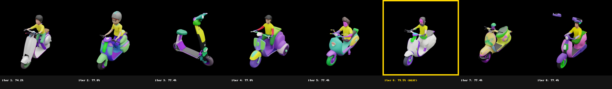

**New VQA scorer, same object:**

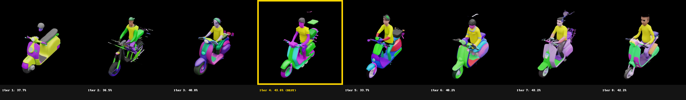

### 5.3 A second reversal: over-boosting

With detection now accurate, a new problem emerged. The original scorer's leniency had caused *under*-boosting (52% of rounds doing nothing); the new, accurate scorer caused the opposite, **73-78% of rounds now hit the maximum simultaneous boost cap of 5 tokens.** This was traced to a real mechanism: each boosted token's magnitude is computed independently with no awareness of the others, so 5 simultaneous boosts create 5 uncoordinated, competing pulls on generation. A separate "zero-mean rebalancing" mechanism compounds this, the more tokens boosted at once, the more aggressively *other, already-correct* tokens get suppressed to compensate, risking damage to parts of the generation that didn't need fixing.

---

## 6. Root-Caused Bugs and Fixes

Direct source code review (rather than continued trial-and-error) surfaced several concrete, previously undiscovered bugs:

**Dead revert-on-decline safeguard.** A `revert_on_decline` configuration flag existed and was exposed via CLI, but was never actually implemented anywhere in the control loop, every round unconditionally built on whatever the immediately preceding round produced, even if that round was worse than several rounds prior. This was fixed to properly fall back to the best-known configuration after a decline. Verified via live log output showing correct reversion behavior and a subsequent recovery to a new best score.

**Verification of the revert fix** (declined rounds outlined in red, best round in gold):

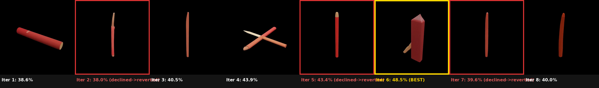

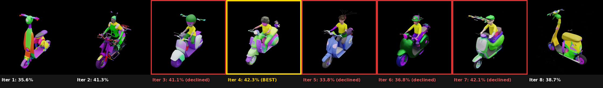

**Per-token boost weight heatmap**, showing which tokens were boosted (red) or suppressed via zero-mean rebalancing (green) across rounds:

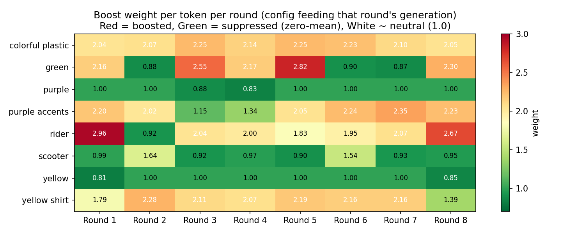

**Broken `--max-boost-tokens` override.** A CLI flag for limiting simultaneous boost count existed but crashed immediately whenever used, due to a broken self-import referencing a non-existent module name (`text_to_text_entropy_ratio_v2` instead of the real file). Fixed with a direct module-level reassignment.

**No memory across rounds, confirmed as an intentional prior trade-off.** Source code comments confirmed that an earlier version accumulated boosts across rounds, causing runaway compounding (a documented example: a "candle" prompt eventually generating twelve candles). The fix removed all cross-round memory entirely, which resolved the compounding bug but left the system unable to learn from a failed correction attempt, a real, acknowledged cost of that earlier fix.

**Bigram adjective-noun mispairing.** A phrase-level boosting mechanism pairs adjectives with their governing noun (so "black" and "wallet" boost together as one phrase, rather than independently) using NLTK POS tagging. Two confirmed failure modes were found and fixed: (1) ambiguous material words like "leather" were frequently mistagged as nouns rather than adjectives even with full sentence context, causing incorrect pairings (e.g., "black leather wallet" pairing "black" to "leather" instead of "black" to "wallet"); (2) the pairing algorithm stopped scanning forward at the *first* noun-tagged word it found, which broke when a repeated or mistagged word sat between the true adjective and its real target noun. Both were fixed: a material-word override list (mirroring an existing color-word override already in the codebase) and a corrected scan that walks through a full run of consecutive noun/modifier-tagged words, taking the *last* one as the true head noun.

---

## 7. Statistical Validation

### 7.1 The central test: does CUBIST beat random-seed resampling?

The most important open question throughout the project was whether CUBIST's iterative refinement genuinely outperforms simply generating 8 unguided random attempts and keeping the best (max-of-N). An early control experiment (June 2026, pre-VQA-scorer) found best-of-8-random-seeds (ImageReward mean 1.045) statistically indistinguishable from full CUBIST (1.007-1.031), a critical, unresolved finding that shaped the decision to move the paper from WACV Round 1 to Round 2.

This question was revisited rigorously after the VQA scorer redesign and bug fixes, using two independent 40-object batches (different random seeds, different code versions) compared against pre-existing random-seed-only videos, both scored identically:

| Metric | Batch 1 (pre-bigram-fix) | Batch 2 (post-bigram-fix) |
|---|---|---|
| Win rate vs. max-of-8 | 33/40 (82.5%) | 34/40 (85.0%) |
| Mean margin | +7.8 percentage points | +8.3 percentage points |
| Effect size (Cohen's d) | 0.97 (very large) | 0.98 (very large) |
| Statistical significance | p ~ 8.4 x 10^-10 | p ~ 5.7 x 10^-10 |

**Reproducibility check:** the two independent batches agreed on the same win/loss outcome for 39 of 40 objects (97.5%), with margins correlating at r=0.90 between runs, direct evidence the effect is real and repeatable rather than a single lucky batch.

**Independent cross-validation:** ImageReward (a metric entirely unrelated to the project's own VQA scorer) was used to score the same batch's round-by-round trajectory. Individual-round medians showed a genuine upward trend from round 4 onward (+0.025 to +0.077), distinct from the flat, noise-level trend seen under the original, pre-fix pipeline.

**Full 40-object batch grids** (8 rounds per object, no boosting-budget fix yet applied):

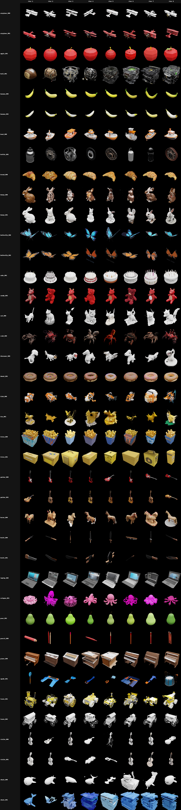

**40-object batch grid, revert fix + reduced boost budget applied:**

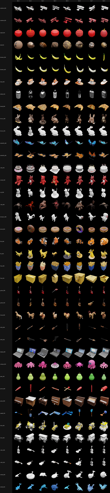

**CUBIST vs. seed-control, side by side, all 40 objects, all rounds/seeds** (gold border = best on each side per row):

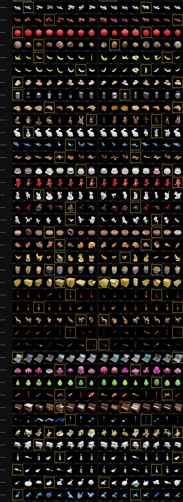

**Score trajectories across all 8 rounds/seeds, all 40 objects** (CUBIST left, seed-control right, shared Y-axis):

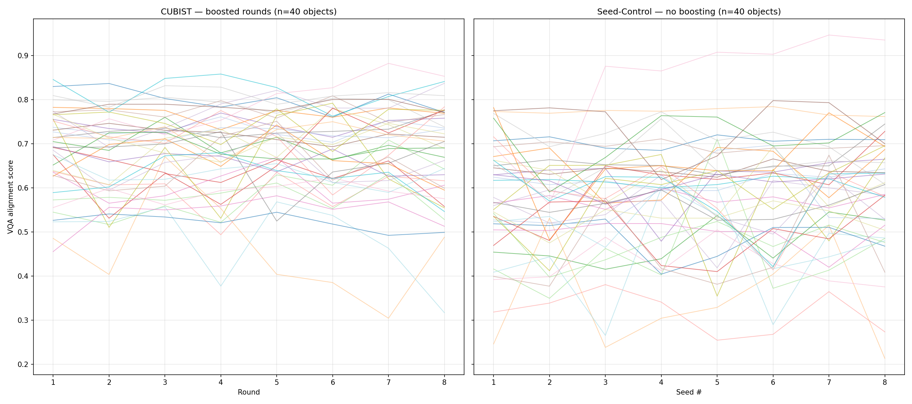

**Margin distribution** (CUBIST best-of-8 minus seed-control best-of-8, both batches):

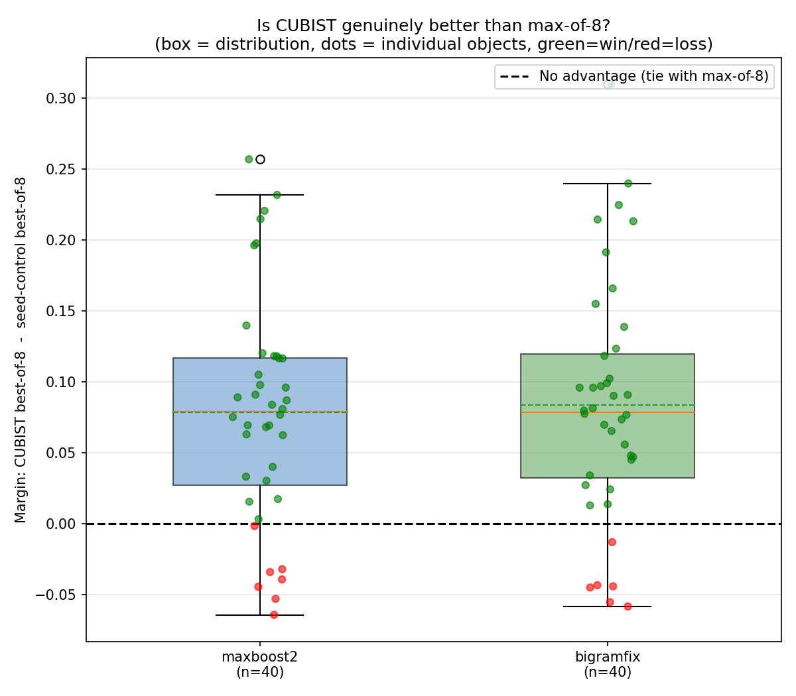

**Absolute performance comparison** (raw best-of-8 scores, three conditions side by side):

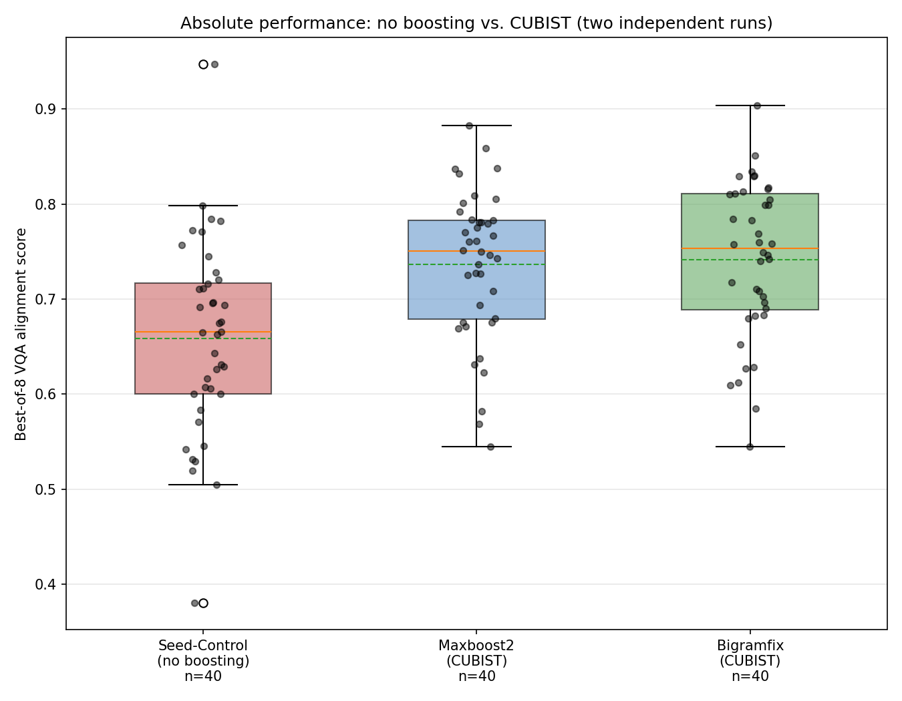

### 7.2 Stratified findings

Splitting objects by starting (baseline) quality revealed a meaningful pattern: low-baseline objects (score below 0.60) gained an average of +0.10 from boosting, while high-baseline objects (0.75 and above) gained only +0.02, a real ceiling effect. Since "best of 8 rounds" can never score below the unboosted baseline by construction, this means CUBIST meaningfully rescues poor generations while leaving already-good generations essentially unharmed.

### 7.3 A same-seed controlled test

To directly isolate the boost mechanism's effect from ordinary generation randomness, a controlled test held the random seed identical between an unboosted baseline and a boosted round for the same object. Result on `motorcycle_001`: baseline 48.96% to boosted (same seed) 65.45%, with the two actually-boosted tokens (`green`, `rider`) each improving by roughly 0.40 points, direct, seed-controlled proof that the boost mechanism itself, not seed luck, drives improvement. Across 5 tested objects, 3 improved substantially, 2 declined, an honest, mixed result at the individual-object level even as the aggregate 40-object statistics remained strongly positive.

**Same-seed baseline vs. boosted, revert-fix run (`motorcycle_001`), reverted/declined rounds outlined in red:**

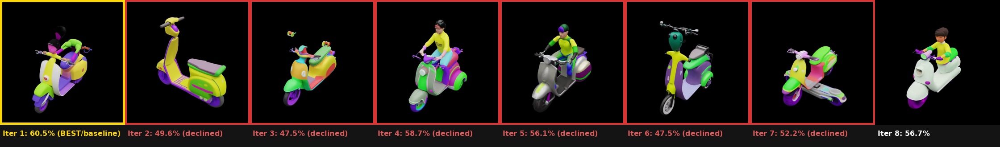

---

## 8. Current Status and Remaining Work

**Established and validated:**
- The original T1/T2 scorer was broken; the VQA-based replacement is validated against known ground-truth errors.
- CUBIST statistically and reproducibly outperforms random-seed resampling (max-of-N) by a large, significant margin, resolving the central open question from the original Round 1 submission.
- Multiple real, previously-undiscovered implementation bugs were found and fixed via direct source auditing rather than continued black-box tuning.

**Open items:**
- The bigram-pairing fix's improvement over the pre-fix pipeline, while directionally positive (85.0% vs. 82.5% win rate), has not yet been confirmed as independently statistically significant against the *pre-fix* pipeline specifically (as opposed to against random-seed resampling, which is confirmed).
- "Best round" selection currently uses only the alignment score, with no quality/coherence check, a confirmed case exists where a visually distorted result scored higher than a clean, correct one.
- The deeper mechanism question, whether the boost's effect size is reliably larger than TRELLIS's own inherent seed-to-seed generation variance, remains only partially tested (H2 variance analysis was started but not completed).
- Toys4K category-count scoping (171 objects / 91-92 categories vs. the originally intended 200/105) and the human study's use of short category prompts rather than full generation prompts remain documented, unresolved limitations flagged for the paper's discussion section.
- Methodology section drafting (Simon's outline: 3.1 Problem Statement, 3.2 Asset Generation, 3.3 CUBIST) is in progress but incomplete.

---

## 9. Repository Contents

This repository contains the full set of diagnostic, evaluation, and analysis scripts developed over the course of the project, including:

- **Scorer implementations:** `Semantic_score_VLM_VQA.py` (dual-check VQA scorer), `Semantic_score_VLM_VQA_YESNO_ONLY.py` (yes/no-only variant), `bigram_boost_FIXED.py` (corrected adjective-noun pairing)
- **Pipeline fixes:** `final_script_FIXED.py` / `final_script_FIXEDSEED.py` (revert-on-decline, boost-budget, and fixed-seed controls), `text_to_text_entropy_ratio_FIXED.py`
- **Batch orchestration:** `vqa_batch_40.py` and variants, SLURM submission scripts (`submit_*.sh`)
- **Statistical analysis:** `effect_size_analysis.py`, `reproducibility_check.py`, `stratified_comparison.py`, `bigramfix_significance.py`
- **Visualization:** grid builders, box plot and trajectory plotting scripts, side-by-side comparison grids
- **Diagnostic scans:** `stuck_token_scan.py`, `overboost_ablation.py`, `threshold_zone_inspector.py`, `h2_variance_test.py`

See individual script docstrings for usage details. All scripts assume the `trellis` conda environment on VT ARC's TinkerCliffs cluster.
