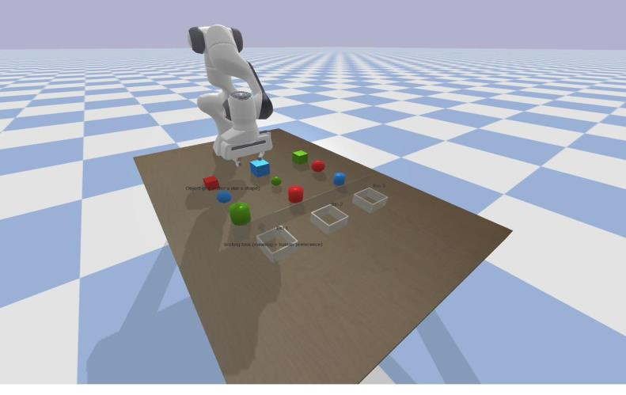
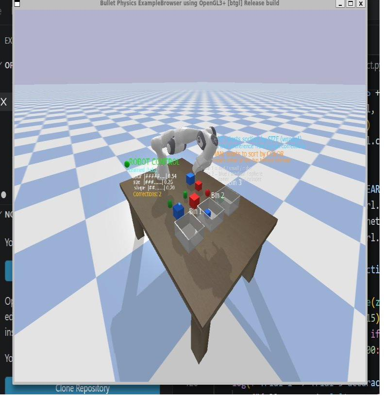
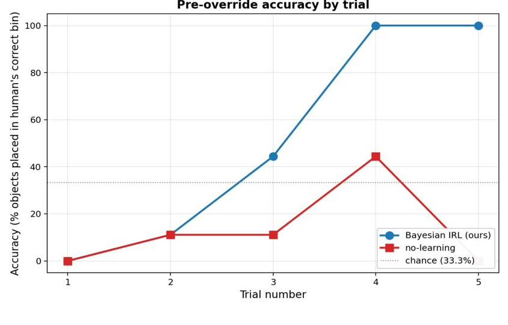
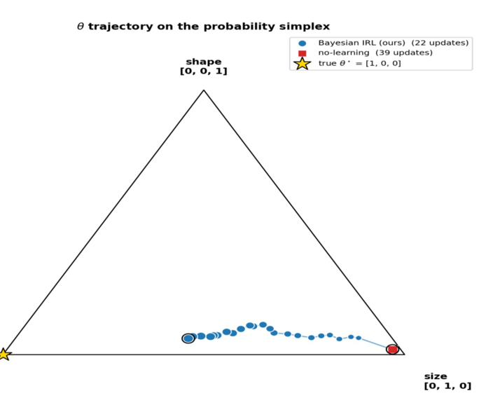

# Online Bayesian IRL from Human Corrections

**Authors:** Rohan Aaron Indupally & Bin Kang
**Course:** Human-Robot Interaction, Virginia Tech, Spring 2026

---

## TL;DR

A Panda robot arm sorts objects into bins. It starts out convinced the human wants them sorted by **size** — but the human actually wants them sorted by **color**. Every time the robot pauses at the wrong bin, the human corrects it, and the robot updates a full probability distribution over what it thinks the human wants, using a 300-particle Bayesian filter. No labeled dataset, no offline training — just a robot getting smarter in real time from a handful of physical corrections. By trial 4, it's sorting with 100% accuracy and zero corrections needed.

[](https://www.youtube.com/watch?v=yRGJsl7YXKE)

*Click to watch the demo video.*

---

## The Problem

Robots are usually programmed with a fixed objective. Humans aren't that predictable — preferences vary by person and context, and a robot can't be pre-programmed to know what every user wants in advance. Instead, it has to learn preferences *from* the human, ideally without needing a full dataset collected up front.

That's the setting here: a Panda arm sorts 9 objects (each with a color, size, and shape) into 3 bins. The human's real preference is to sort by **color** — but the robot starts out believing the sorting rule is **size**. The only way the robot can learn the truth is through the human physically correcting it, one object at a time, live, during the task.

<p align="center">
  <br>
  <em>The PyBullet simulation: nine color/size/shape objects on a table, three sorting bins, one Panda arm.</em>
</p>

---

## How the Robot Learns

Instead of maintaining a single guess about what the human wants, the robot maintains a **full probability distribution** over the possible sorting rule — represented by 300 weighted particles, each a guess at how much the human cares about color vs. size vs. shape.

Every time the human corrects the robot:

1. **Reweight** — each particle gets scored on how well it explains that correction, combined with a prior that resists change
2. **Resample** — particles that explain the correction well get to "survive"; bad ones get discarded
3. **Diversify** — 40 rounds of small random nudges (Metropolis-Hastings sampling) keep the particle set from collapsing into a single point too early

The result is a belief that shifts *gradually*, the same way a person might slowly update their assumptions rather than flipping instantly after one data point. That gradualness is deliberate: a naive version of this update collapses to the right answer after a single correction, which isn't a very interesting (or realistic) learning curve.

A tunable prior strength parameter controls exactly how much evidence it takes to shift the robot's belief — tuned here so the robot needs roughly a full trial's worth of corrections before it visibly starts changing its behavior.

<p align="center">
  <br>
  <em>Live on-screen HUD showing the robot's current belief (color/size/shape weights) and running correction count mid-sort.</em>
</p>

---

## Results

Across 5 trials of 9 objects each, the robot needed:

- **5–6 corrections** in trial 1 (it's still convinced sorting is by size)
- **2–3 corrections** in trial 2
- **1 correction** in trial 3
- **0 corrections** in trials 4 and 5 — fully converged

Accuracy (percentage of objects placed correctly *before* any human correction) rose from **0% to 100%** over those trials, while a no-learning baseline (frozen belief) stayed near random chance the whole time.

<p align="center">
  <br>
  <em>Pre-override accuracy by trial — Bayesian IRL (blue) climbs to 100%, while the no-learning baseline (red) hovers near chance.</em>
</p>

You can also watch the robot's belief physically walk across a probability simplex from "size" toward "color" as corrections accumulate:

<p align="center">
  <br>
  <em>Each dot is the robot's belief after one correction, drifting from the size corner toward the true color-based preference (gold star).</em>
</p>

---

## Why This Is Different From Just "Learning the Right Answer"

A simpler approach would just snap to the correct answer the moment it's contradicted. We didn't want that, for two reasons:

1. **It's not how uncertainty actually works.** One correction is weak evidence. A robot that flips its entire behavior after a single data point isn't reasoning about uncertainty, it's just pattern-matching.
2. **It maps naturally onto shared autonomy.** Early on, the human has to intervene constantly (high "authority"). As evidence accumulates, the robot earns more autonomy. That transfer of control happens continuously and automatically, driven by how much evidence has piled up, not by a hand-coded schedule.

This builds directly on prior work by Losey et al. (IJRR 2022) on learning robot objectives from physical corrections. The key extension here: their method converges to a single best-guess value instantly, while this system tracks a full distribution, producing the slower, more interpretable learning curve above.

**A real limitation, worth being upfront about:** the reward model here assumes the human's preference is a simple linear combination of color/size/shape. A person with more complex, nonlinear preferences wouldn't be captured by this model as-is.

---

## System Overview

| Component | Role |
|---|---|
| `main_project.py` | Main control loop — grasping, inverse kinematics, human override window |
| `bayesian_irl_project.py` | 300-particle Bayesian posterior update |
| `sort_objects_project.py` | Object and bin definitions, reward function |
| `human_model_project.py` | Simulated or real (keyboard-controlled) human corrections |
| `display_project.py` | Live on-screen display — belief bars, correction counter |
| `robot.py` | Panda arm interface (PyBullet) |

---

## Setup & Run

```
git clone https://github.com/vt-hri/HW4.git
cd HW4
python3 -m venv venv && source venv/bin/activate
pip install numpy pybullet
python main_project.py
```

Watch the belief bars on screen shift across trials as the robot learns.

---

## References

- Abbeel & Ng, *Apprenticeship learning via inverse reinforcement learning*, ICML 2004
- Losey, Bajcsy, O'Malley & Dragan, *Physical interaction as communication: Learning robot objectives online from human corrections*, IJRR 2022
- Javdani, Srinivasa & Bagnell, *Shared autonomy via hindsight optimization*, RSS 2015
- Ramachandran & Amir, *Bayesian inverse reinforcement learning*, IJCAI 2007

---

## Repository Contents

| File | Description |
|---|---|
| `main_project.py` | Main simulation loop |
| `bayesian_irl_project.py` | Bayesian IRL update logic |
| `sort_objects_project.py` | Object/bin/reward definitions |
| `human_model_project.py` | Human correction models |
| `display_project.py` | Live HUD display |
| `robot.py` | Panda arm interface |
| `HRI_project_report.pdf` | Full written report |
| `team_contributions.docx` | Team contribution breakdown |
| `images/` | Figures used in this README |
