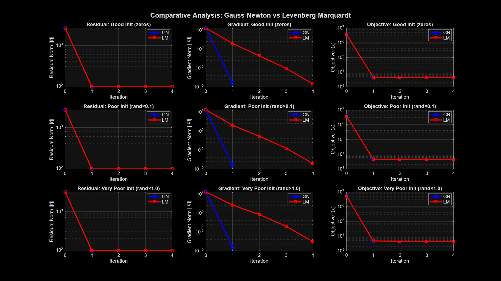
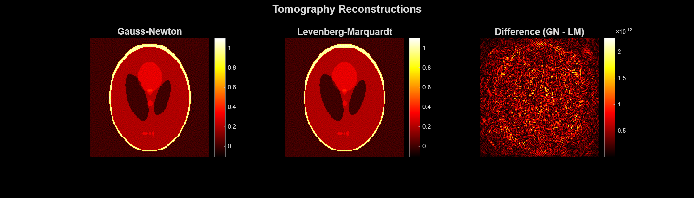
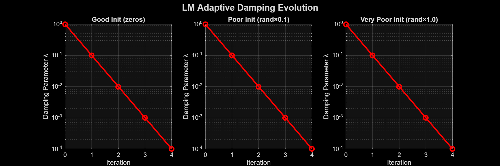

# Gauss-Newton vs. Levenberg-Marquardt: Large-Scale Tomography Reconstruction

**Authors:** Rohan Aaron Indupally 


---

## TL;DR

Implemented and compared two classic nonlinear least-squares solvers, Gauss-Newton and Levenberg-Marquardt, on a real, large-scale CT (computed tomography) image reconstruction problem: recovering a 128×128 pixel image (16,384 unknowns) from 48,964 noisy X-ray measurements. Both methods were tested from three initializations ranging from "good" to "deliberately terrible," to see which one holds up better when you don't know your starting point is any good.

**The headline result:** on this particular (regularized, linear, well-conditioned) problem, both methods converged to the same answer, and Gauss-Newton got there in fewer iterations and less time. That's not a failure of Levenberg-Marquardt, it's actually the more interesting finding: robustness only shows its value when a problem is genuinely difficult, and this analysis explains exactly why.

---

## The Problem

Computed tomography reconstruction is the classic real-world example of a large-scale inverse problem: you have X-ray measurements taken from many angles, and you need to work backward to recover the internal image that produced them. Mathematically, this becomes a least-squares minimization:

```
minimize (1/2) ||Ax - b||²
```

where `x` is the unknown image (flattened into a vector), `A` encodes the X-ray geometry, and `b` is the noisy measured data. With regularization included, this problem has:

- **16,384 variables** (a 128×128 pixel image)
- **48,964 measurements**
- A sparse, large-scale structure typical of real medical imaging problems

---

## The Two Methods

**Gauss-Newton (GN)** approximates the problem's curvature using only first-derivative information (`JᵀJ`), giving fast, quadratic convergence near a solution, but with no guarantee it won't diverge from a bad starting point.

**Levenberg-Marquardt (LM)** adds an adaptive damping term `λ` to the same system. When a step works, `λ` shrinks and the method behaves more like Gauss-Newton (fast). When a step fails, `λ` grows and the method behaves more like gradient descent (slow but safe). This makes it a **trust-region method** — cautious when uncertain, aggressive when confident.

---

## Experimental Design

To stress-test robustness, both methods were run from three deliberately different starting points:

| Initialization | Description | Rationale |
|---|---|---|
| **Good** | `x₀ = 0` | Natural starting point under Tikhonov regularization |
| **Poor** | `x₀ = random × 0.1` | Simulates a rough prior estimate with noise |
| **Very Poor** | `x₀ = random × 1.0` | Deliberately bad — worst-case stress test |

Convergence was measured against `‖∇f(x)‖ < 10⁻⁶`, with iteration count, wall-clock time, final residual norm, and final gradient norm all tracked.

---

## Results

| Initialization | Method | Iterations | Time (s) | Final ‖r‖ | Final ‖∇f‖ |
|---|---|---|---|---|---|
| Good (zeros) | GN | 2 | 78.3 | 9.51×10¹ | 1.07×10⁻⁹ |
| Good (zeros) | LM | 5 | 279.5 | — | 6.09×10⁻¹⁰ |
| Poor (rand×0.1) | GN | 2 | 69.1 | — | 1.09×10⁻⁹ |
| Poor (rand×0.1) | LM | 5 | 285.8 | — | 2.78×10⁻⁹ |
| Very Poor (rand×1.0) | GN | 2 | 62.4 | — | 1.11×10⁻⁹ |
| Very Poor (rand×1.0) | LM | 5 | 303.2 | — | 2.83×10⁻⁸ |

**Both methods converged to essentially the same solution** (residual norm ≈ 95, matching the expected measurement noise floor) **from every initialization tested** — including the deliberately terrible one.

<p align="center">
  <br>
  <em>Residual, gradient, and objective convergence across all three initializations. GN (blue) and LM (red) both converge cleanly; GN reaches the floor in fewer steps.</em>
</p>

### Reconstructed Images

Both methods recovered visually identical reconstructions — the difference between them is on the order of 10⁻¹², effectively numerical noise.

<p align="center">
  <br>
  <em>Left: Gauss-Newton reconstruction. Center: Levenberg-Marquardt reconstruction. Right: pixel-wise difference, essentially zero.</em>
</p>

### LM's Adaptive Damping in Action

LM's damping parameter `λ` starts at 1.0 (conservative) and shrinks by a factor of 10 with every successful step, ending near 10⁻⁴ — meaning that by the end, LM had essentially converged into behaving like Gauss-Newton. This is the trust-region mechanism working exactly as designed.

<p align="center">
  <br>
  <em>LM's damping parameter across all three initializations — consistently decaying toward Gauss-Newton-like behavior as the solution is approached.</em>
</p>

---

## Why Didn't Levenberg-Marquardt "Win"?

This is the most important finding in the project, and it's a real, defensible conclusion rather than a disappointing null result:

1. **The problem is actually linear.** The tomography residual is `r(x) = Ax - b`, so the Gauss-Newton curvature approximation isn't an approximation at all here, it's exact. GN's main theoretical weakness (a poor curvature estimate) simply doesn't apply.
2. **Tikhonov regularization keeps the problem well-conditioned.** A major reason GN diverges on hard problems is a singular or near-singular `JᵀJ`. Regularization prevents that here.
3. **Even the "very poor" initialization wasn't actually that poor**, relative to the solution's scale, in a well-conditioned convex problem.

**The honest takeaway:** Levenberg-Marquardt's robustness advantage is real, but it only shows up on problems that are genuinely nonlinear or ill-conditioned. On a nicer problem, paying LM's extra computational cost (LM took ~4x longer here) buys you nothing. Knowing *when* to reach for the more robust, more expensive method — rather than defaulting to it everywhere — is itself the practical skill this project set out to demonstrate.

---

## Practical Recommendations

**Use Gauss-Newton when:**
- You have a reasonable initial guess
- The problem is well-conditioned
- Speed matters and you can restart with a better guess if it fails

**Use Levenberg-Marquardt when:**
- Your initialization is genuinely uncertain
- The problem may be ill-conditioned or strongly nonlinear
- Robustness matters more than raw speed

---

## Real-World Applications

This comparison isn't just academic — the GN/LM tradeoff shows up constantly in practice:

- **Medical imaging** (CT, MRI reconstruction) — exactly the problem class tested here
- **Robotics** — kinematic calibration, SLAM, and sensor fusion, all naturally posed as nonlinear least-squares problems where LM's robustness to poor initial estimates matters
- **Machine learning** — LM is a classic method for training small-to-medium neural networks, more robust than plain gradient descent on ill-conditioned loss surfaces
- **Engineering & scientific computing** — structural parameter identification, aerodynamic shape optimization, inverse problems governed by ODEs/PDEs
- **Finance** — calibrating volatility surfaces and other models against noisy market data

---

## Limitations & Future Work

- Only tested on one problem (tomography), and it happens to be linear — a genuinely nonlinear test case would likely show a much larger gap favoring LM
- Didn't test severely ill-conditioned problems, where GN would be expected to fail outright
- Future extensions: nonlinear curve-fitting problems, Dogleg trust-region methods, line-search variants of GN, and L-BFGS for even larger-scale problems (n > 10⁶)

---

## Repository Contents

| File | Description |
|---|---|
| `gauss_newton.m` | Gauss-Newton solver implementation |
| `levenberg_marquardt.m` | Levenberg-Marquardt solver with adaptive damping |
| `compare_gn_lm.m` | Main script — runs both methods across all three initializations, generates all comparison plots |
| `test_gauss_newton.m` | Standalone Gauss-Newton test/validation script |
| `test_lm.m` | Standalone Levenberg-Marquardt test/validation script |
| `SG_tomo.mat` | Tomography problem data (system matrix `Ae`, measurements `bn`) |
| `MATH5544_Final_Project_Report.pdf` | Full written report |
| `images/` | Result figures used in this README |

## References

1. Nocedal, J., & Wright, S. J. (2006). *Numerical Optimization* (2nd ed.). Springer.
2. Björck, Å. (1996). *Numerical Methods for Least Squares Problems*. SIAM.
3. Marquardt, D. W. (1963). An algorithm for least-squares estimation of nonlinear parameters. *Journal of the Society for Industrial and Applied Mathematics*, 11(2), 431–441.
4. Moré, J. J. (1978). The Levenberg-Marquardt algorithm: Implementation and theory. In *Numerical Analysis* (pp. 105–116). Springer.
