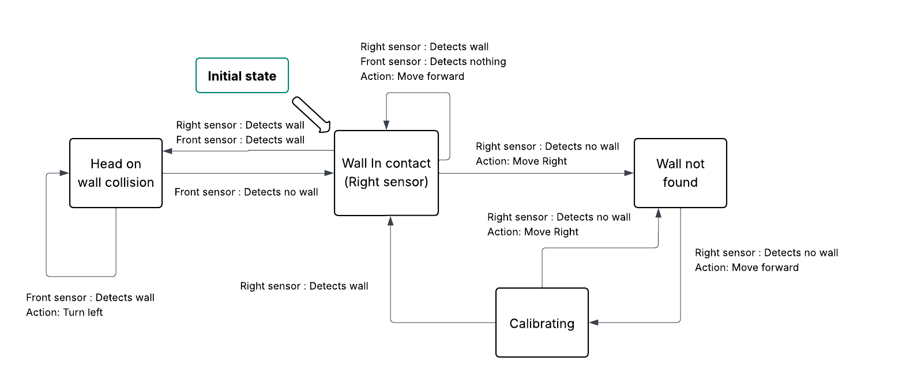
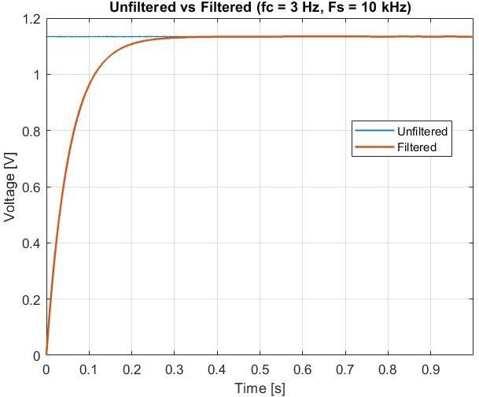
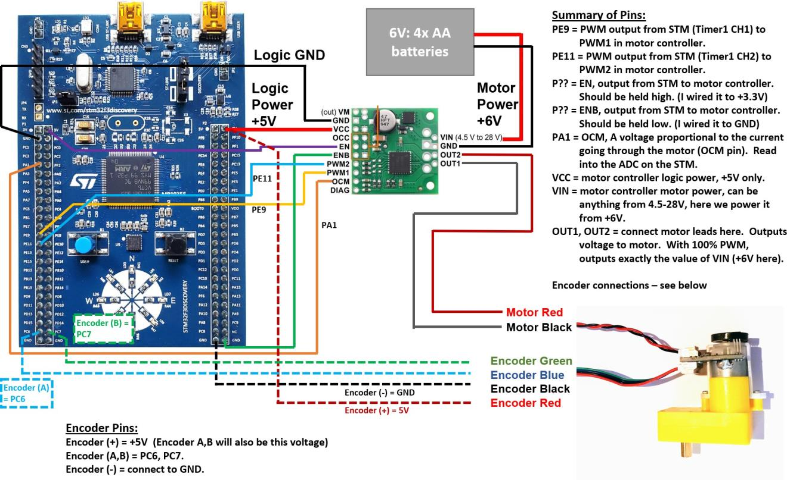

# STM32 Embedded Systems: From State Machines to Sensor Fusion

**Author:** Rohan Aaron Indupally
**Platform:** STM32F3 Discovery Board
**Course:** Mechatronics, Virginia Tech

---

## TL;DR

A progressive build-up of embedded systems skills on the STM32F3 Discovery board, starting from pure software state machines and ending with a fully instrumented motor control and sensor system. Along the way: interrupt-driven timing, UART communication, PWM motor control with encoder feedback, I2C sensor fusion (accelerometer, gyroscope, magnetometer), and ADC signal processing with real noise analysis and digital filtering. Each module builds on the last — this collection represents the full pipeline from "how do I think about state" to "how do I extract a clean signal from a noisy real-world sensor."

---

## Project Modules

| # | Module | Core Skill |
|---|---|---|
| 1 | State Machine Design | Reasoning about state before writing code |
| 2 | Interrupt-Driven Control | Hardware timers, debouncing, GPIO interrupts |
| 3 | UART Communication | Serial protocols, interrupt-driven RX/TX |
| 4 | ADC Signal Processing | Noise analysis, FFT, digital filtering |
| 5 | PWM Motor Control | Motor characterization, encoder feedback, efficiency analysis |
| 6 | I2C Sensor Integration | Multi-sensor fusion, register-level configuration |

---

## Module 1: State Machine Design

Before touching any hardware, this module is about learning to reason in **states, triggers, and actions** — the mental model everything else in this project builds on.

**Wall-following robot:** given a simulated robot with front and right-side sensors, design a state machine that lets it navigate a maze by keeping a wall on its right at all times, recovering gracefully from dead ends.

   
  <em>State diagram for the wall-following robot — handles wall contact, dead-end recovery, and re-acquiring a lost wall.</em>

The robot was then implemented in C and run in a maze simulator, successfully navigating to the exit autonomously.

**Microwave state machine debugging:** given a working-but-flawed microwave control state machine, the task was to find where it didn't match real-world microwave behavior (no pause functionality, no way to reset a completed cook time) and redesign it correctly.

   
  <em>Corrected state diagram — added a Pause state and fixed the reset-on-double-cancel behavior.</em>

---

## Module 2 & 3: Interrupt-Driven Control + UART Communication

This module moves from theoretical state machines to a **real interrupt-driven stopwatch** running on the STM32, combining hardware timers, GPIO interrupts, debouncing, and full-duplex UART communication.

**What it does:** a stopwatch with two physical buttons (start/pause, sample elapsed time) and equivalent UART keyboard commands (`s`, `f`, `p`), running entirely on hardware interrupts — no polling loop.

**Key engineering details:**
- **TIM6** provides the stopwatch's 0.01s time base
- **TIM7** implements a 1-second software debounce so a single button press can't be read as multiple triggers
- **EXTI (external interrupt)** callbacks handle both physical buttons
- **UART RX interrupt** parses single-character commands and mirrors the same start/pause/sample/reset functionality from a connected terminal
- The entire control flow is a finite state machine (`STOPWATCH_PAUSED` / `STOPWATCH_RUNNING`) — a direct, hardware-level implementation of the same state-machine thinking from Module 1

This is a genuinely good example of the jump from "design a state machine on paper" to "implement one that has to survive real electrical noise, debounce issues, and race conditions between interrupts."

---

## Module 4: ADC Signal Processing

Real sensors are noisy. This module is entirely about **characterizing and cleaning up that noise** — a skill that matters far beyond this one lab.

**The experiment:** read a potentiometer through the ADC under three conditions, and see how the noise floor changes:

1. **Actively wiggling the potentiometer** (clean, expected signal)
2. **Potentiometer held steady** (isolates the ADC/system's intrinsic noise — ~14 ADC counts RMS, about 5.4 effective noise-free bits out of 12)
3. **Input wire completely disconnected**, acting as an antenna

   
  <em>Floating ADC pin picking up ambient electrical noise — RMS jumps from ~14 counts to 369 counts, and effective resolution collapses to under 1 bit.</em>

**FFT analysis** on the same noise data revealed clear power-line interference at 60 Hz and its harmonics — a classic real-world noise signature.

**Digital low-pass filtering:** implemented a software low-pass filter (3 Hz cutoff, derived via bilinear transform) directly on the microcontroller, transmitting both the raw and filtered signal simultaneously over UART for side-by-side comparison.

   
  <em>Step response of the onboard digital low-pass filter — clean convergence with a measurable, expected delay.</em>

---

## Module 5: PWM Motor Control & Characterization

This module wires a DC gearmotor and motor controller to the STM32, drives it with PWM, and fully characterizes its real-world performance — not just "does it spin," but its actual speed-torque curve, efficiency, and how those compare to the datasheet.

   
  <em>Full wiring diagram: STM32F3 Discovery, motor controller, gearmotor, and encoder connections.</em>

**What the system does:**
- PWM duty cycle controlled via UART commands (`0`-`9` for 0–90%, `=` for 100%, `f`/`r` for direction)
- Real-time current sensing through the ADC (via the motor controller's current-sense pin)
- Quadrature encoder feedback for shaft speed and position

**Characterization performed:**
- Encoder position and angular velocity extraction across a full PWM sweep

  
  

- **No-load speed and current** measurement at full power
- **Loaded speed-torque points** collected by hanging known weights from the output shaft via a string-and-pulley setup, at four different loads
- Derived the **speed-current relationship** (linear fit), extrapolated **no-friction no-load speed**, and estimated **stall current** — compared directly against the motor's datasheet specification
- Computed **overall motor + gearbox efficiency** across the load range by comparing mechanical output power (torque × speed) against electrical input power, accounting for I²R heating losses in the motor coils
- Final combined plot: speed, current, efficiency, and mechanical power, all overlaid against torque — the standard way motor performance is characterized in industry datasheets

This module is the most "full-stack" of the set: it touches PWM generation, ADC sensing, encoder-based state estimation, and closes the loop with real physical measurement and datasheet validation.

---

## Module 6: I2C Sensor Integration

The final module integrates a 9-axis IMU (accelerometer, gyroscope, magnetometer) over I2C, with all register configuration done at the datasheet level rather than through a black-box library.

**What was configured, register by register:**
- **Accelerometer** — output data rate, power mode, per-axis enable, full-scale range
- **Gyroscope** — data rate and bandwidth selection, per-axis enable
- **Magnetometer** — output data rate, temperature compensation, continuous-measurement mode

**Real debugging insight:** the accelerometer's raw output only changes in steps of 16, not 1 — because the sensor operates in 12-bit high-resolution mode but reports through 16-bit registers, left-justified, with the bottom 4 bits carrying no real data. Recognizing effective resolution vs. nominal register width is a common real-world sensor gotcha.

**Sensor fusion validation:** rotating the board flat while watching the magnetometer's X/Y output confirmed the expected ~90°-out-of-phase sinusoidal behavior as the sensor's axes rotated relative to Earth's magnetic field — a simple, physical sanity check that the sensor fusion pipeline is actually reading real physics, not noise.

**Systems-level thinking:** given a scenario of I2C sensor data corrupted by a nearby high-current motor, the writeup covers a full stack of mitigations — decoupling capacitors, ground separation from motor return paths, shielded/twisted I2C lines, reduced clock speed for noise immunity, and software-level retry/filtering — tying directly back into the noise-characterization lessons from Module 4.

---

## Why This Progression Matters

Each module isn't isolated — they build a single coherent skill set:

- **Module 1** teaches you to think in states before you write a line of embedded code
- **Modules 2–3** turn that thinking into real interrupt-driven hardware control
- **Module 4** teaches you that every sensor reading is a signal-plus-noise problem, and gives you the tools (RMS, FFT, filtering) to deal with it
- **Module 5** combines control (PWM), sensing (ADC + encoder), and real-world validation (comparing measurements against a datasheet) into one closed-loop system
- **Module 6** applies all of it — interrupts, ADC/register-level configuration, and noise awareness — to a real multi-sensor fusion problem

Together, this is the standard mechatronics pipeline: **sense → process → actuate**, built up one deliberate piece at a time.

---

## Repository Contents

| File/Folder | Description |
|---|---|
| `lab3_stopwatch.c` | Interrupt-driven stopwatch (Modules 2 & 3) |
| `Lab_1_State_Machines.pdf` | State machine design writeups (Module 1) |
| `Lab_2_State_Machine_Notes.pdf` | Additional state machine pseudocode and clock-frequency analysis |
| `Lab_4_ADC_Signal_Processing.pdf` | Noise analysis, FFT, and filtering writeup (Module 4) |
| `Lab_5_Motor_Characterization.pdf` | Motor wiring, PWM control, and full characterization report (Module 5) |
| `Lab_6_IMU_Integration.pdf` | I2C sensor register configuration and validation (Module 6) |
| `Embedded_Control_System_Report.docx` | Consolidated written report |
| `images/` | Figures used in this README |
