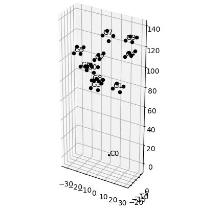
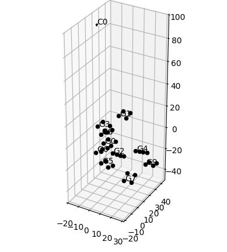
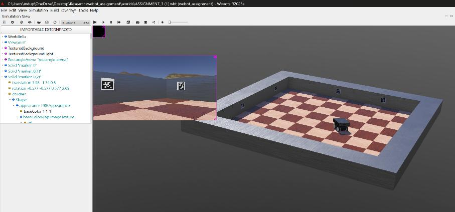
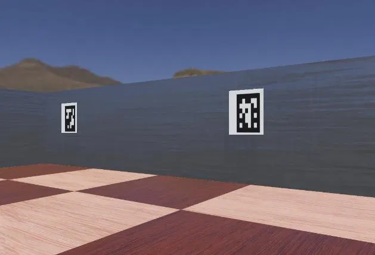
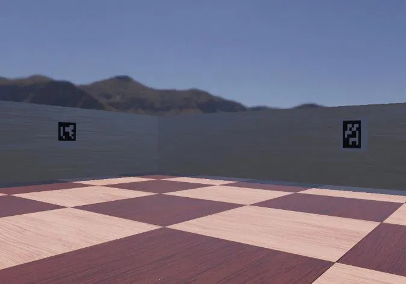

# Marker-Based Mapping System — Factor-Graph SLAM with ArUco Markers

**Author:** Rohan Aaron Indupally

---

## TL;DR

Built a SLAM pipeline that uses ArUco markers and factor-graph optimization to jointly estimate camera poses and marker positions from a set of photos. The optimizer converged cleanly, but comparing results against physical measurements uncovered a systematic **5–6× scale error**, traced back to a **unit mismatch** between the calibration data (centimeters) and the marker measurements (inches). Also built a simulated Webots version of the same pipeline; data collection worked, but a file-logging bug prevented the solver from running end-to-end. Full breakdown of both below.

---

## Overview

Given a set of photos of ArUco markers taken from different positions, this project jointly estimates **where the camera was standing (poses)** and **where the markers actually are in space (the map)** — a classic **Simultaneous Localization and Mapping (SLAM)** problem, solved here using **factor-graph optimization**. The pipeline was built and tested in two settings: a physical environment with real photos and printed markers, and a simulated Webots environment with a robot navigating a virtual arena.

---

## Part 1: Physical Environment — ✅ Complete

### Setup

- 10 printed ArUco markers (`DICT_6X6_250`), 7 inches per edge
- 8 photos taken from different viewpoints, each capturing 3+ markers for redundancy
- Resulting system: 108 variables, 48+ constraints — comfortably over-constrained for a stable solve

### Pipeline

1. **Camera calibration** from checkerboard photos (intrinsics + distortion)
2. **ArUco detection** → 2D pixel coordinates (18 total detections across 8 photos)
3. **Initial pose estimation** via `solvePnP`
4. **Factor graph construction** — 72 pixel-based reprojection factors
5. **Levenberg-Marquardt optimization** (ε = 5×10⁻⁶, max 50 iterations)

### Results

The optimizer converged reliably over 16 iterations:

| Step | Error | Notes |
|---|---|---|
| 0 | 419,798.75 | Initial |
| 1 | 585,292.96 | Damping adjustment |
| 2 | 24,202.96 | Rapid decrease |
| 6 | 516.34 | Near convergence |
| 7–16 | → 513.71 | Converged ✓ |

Final pixel reprojection error: **< 1 pixel**.

**Before and after optimization:**

<table>
<tr>
<td align="center"><b>Initial Guess</b> </td>
<td align="center"><b>Final Optimized Plot</b> </td>
</tr>
</table>

*Camera poses (C0–C7) and marker positions (G0–G9) reconstructed in 3D. Spatial relationships are qualitatively correct.*

### The Interesting Part: A Scale Error, Not a Solver Bug

The optimizer converged cleanly — but comparing the reconstructed inter-marker distances against physical tape-measure readings revealed a **systematic 5–6× scale error**:

| Marker Pair | Optimized (in) | Physical (in) |
|---|---|---|
| 0 to 5 | 19.99 | 12.00 |
| 0 to 6 | 39.80 | 16.00 |
| 5 to 6 | 47.91 | 30.00 |

**Root cause:** the camera calibration checkerboard was specified in **centimeters** (2.5 cm/square), while the ArUco marker size and physical measurements in the code were treated as **inches**. That unit mismatch propagated directly into the final scale.

**The key lesson:** the algorithm converged to a *mathematically consistent* solution — just one expressed in the wrong units. Relative geometry was correct; absolute scale was not.

### Best Practices Identified

1. Define units at project start (e.g., everything in meters)
2. Convert all measurements immediately upon collection
3. Add sanity checks comparing optimized distances to expected ranges
4. Document conversion factors explicitly in code comments
5. Validate calibration against known physical references
6. Test on simulated data first, where ground truth is known

---

## Part 2: Simulated Environment (Webots) — ⚠️ Partial

### Setup

- **World:** checkerboard floor, 10 markers mounted on the arena walls
- **Controller type:** `Supervisor` (for global scene access, vs. the standard `Robot` class)
- **Camera:** RGB camera with live ArUco detection overlay
- **Controls:** `W/S` — forward/back, `A/D` — turn, `P` — capture image + log marker poses

  

<em>Webots simulation environment — arena with checkerboard floor and wall-mounted ArUco markers</em>

<table>
<tr>
<td align="center"></td>
<td align="center"></td>
</tr>
</table>

*Real-time ArUco marker detection from the robot's onboard camera as it moves through the arena.*

### Data Collected

10 PNG images, each with 2+ markers visible, captured via keyboard-triggered logging (`P` key).

### What Went Wrong

**Intended workflow:** image capture → marker pose logging (CSV) → notebook loads data → solver runs

**What actually happened:** the pose log file remained empty despite repeated `P` key presses — the solver never ran because it had no data to work with.

**Root causes identified:**

1. File opened in append mode (`open(..., "a")`) without an explicit `.flush()` call
2. `robot.getFromDef()` may have silently failed if DEF names didn't match
3. Possible file path sync/buffering delays
4. Possible CSV formatting mismatch or incomplete line writes

**Fix required:** add debug prints at each stage, verify node access explicitly, force file flushing after every write, and test the logging step in isolation before running the full pipeline.

---

## Key Takeaway

Modern SLAM algorithms are mathematically elegant and computationally reliable — but **end-to-end integration is where the real engineering happens**. This project surfaced two very different failure modes: a **silent, systematic error** (unit mismatch) that didn't crash anything — the algorithm converged and looked correct until checked against ground truth — and a **loud, obvious failure** (empty log file) that stopped the pipeline entirely before the solver could even run.

Both point to the same lesson: correctness at the algorithm level isn't enough. Careful attention to units, calibration, and incremental validation at every stage of the pipeline matters just as much as the math itself.

---

## Repository Contents

| File | Description |
|---|---|
| `A4.py` | Solver script — camera calibration, ArUco detection, factor-graph construction, Levenberg-Marquardt optimization |
| `controller.py` | Webots supervisor controller — robot motion, camera feed, real-time ArUco detection, marker pose logging |
| `Assignment_4_Report.pdf` | Full write-up with detailed methodology, results, and analysis |
| `Images/` | Result plots and simulation screenshots |
