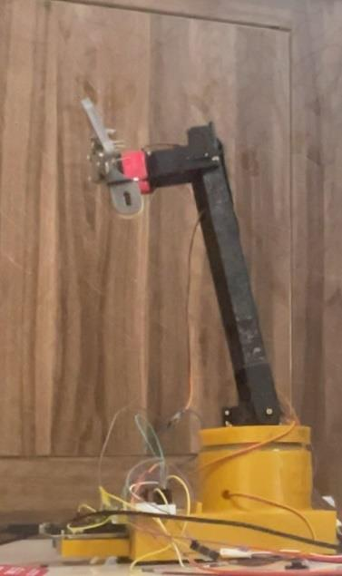
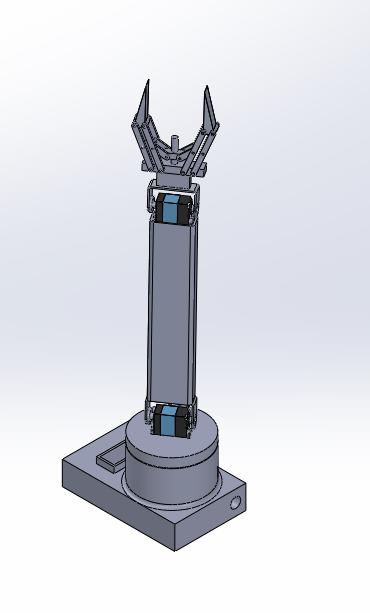
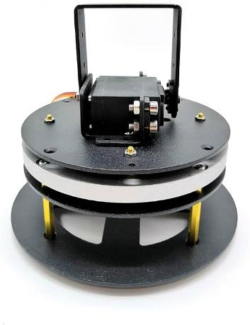
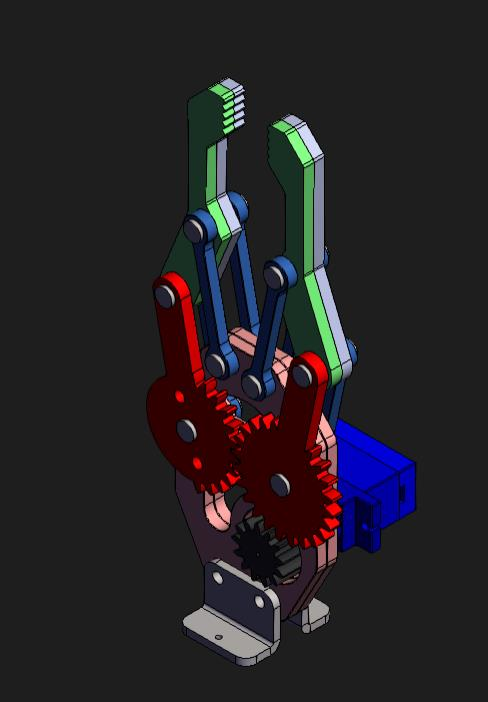
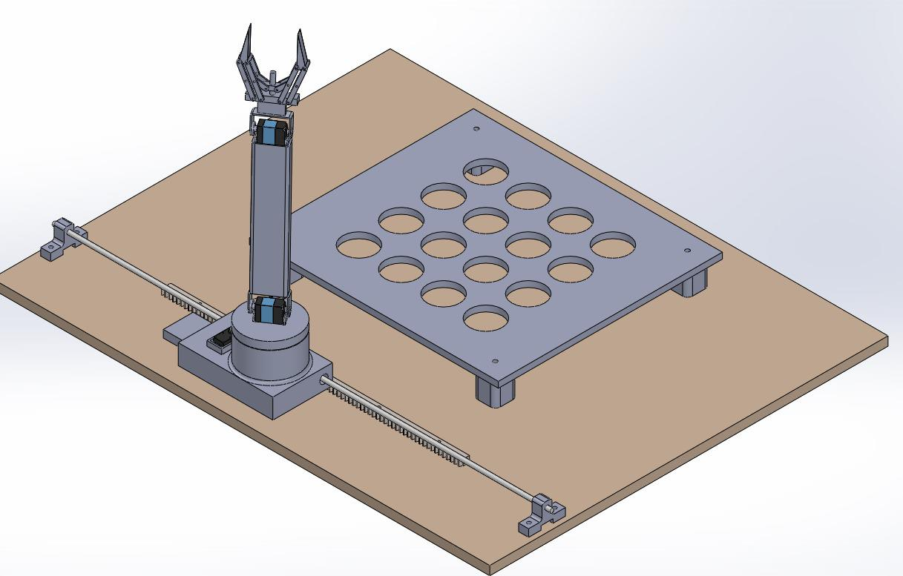
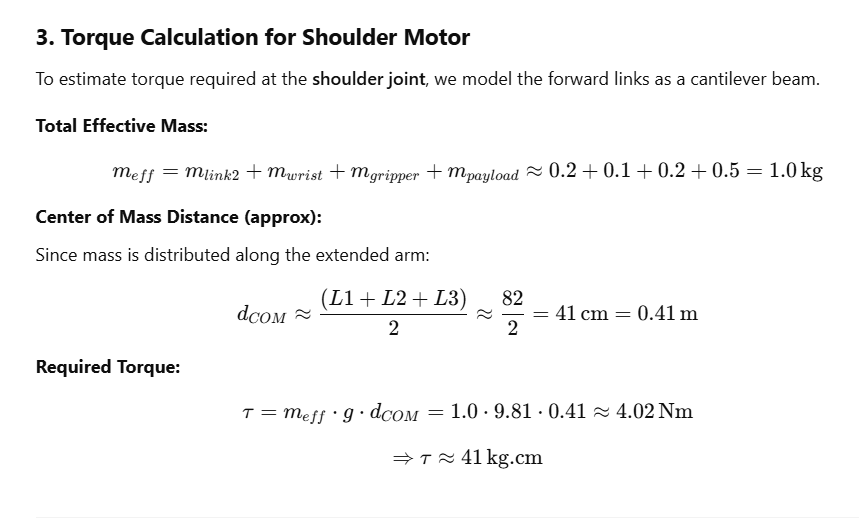
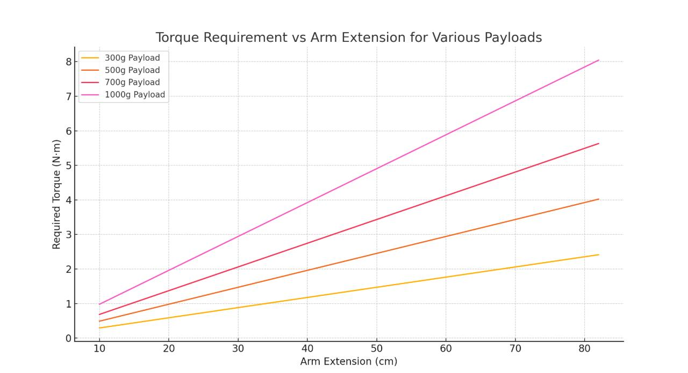
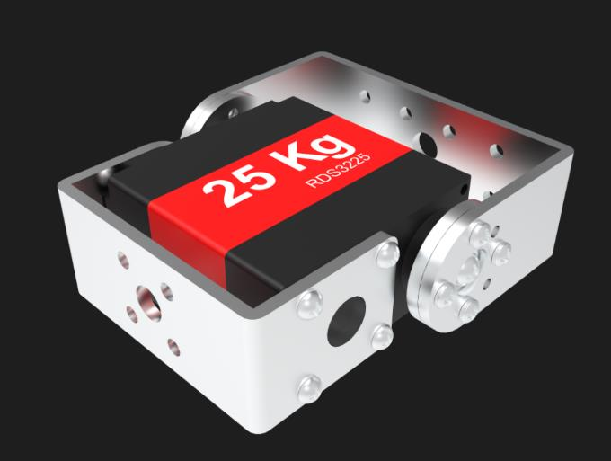
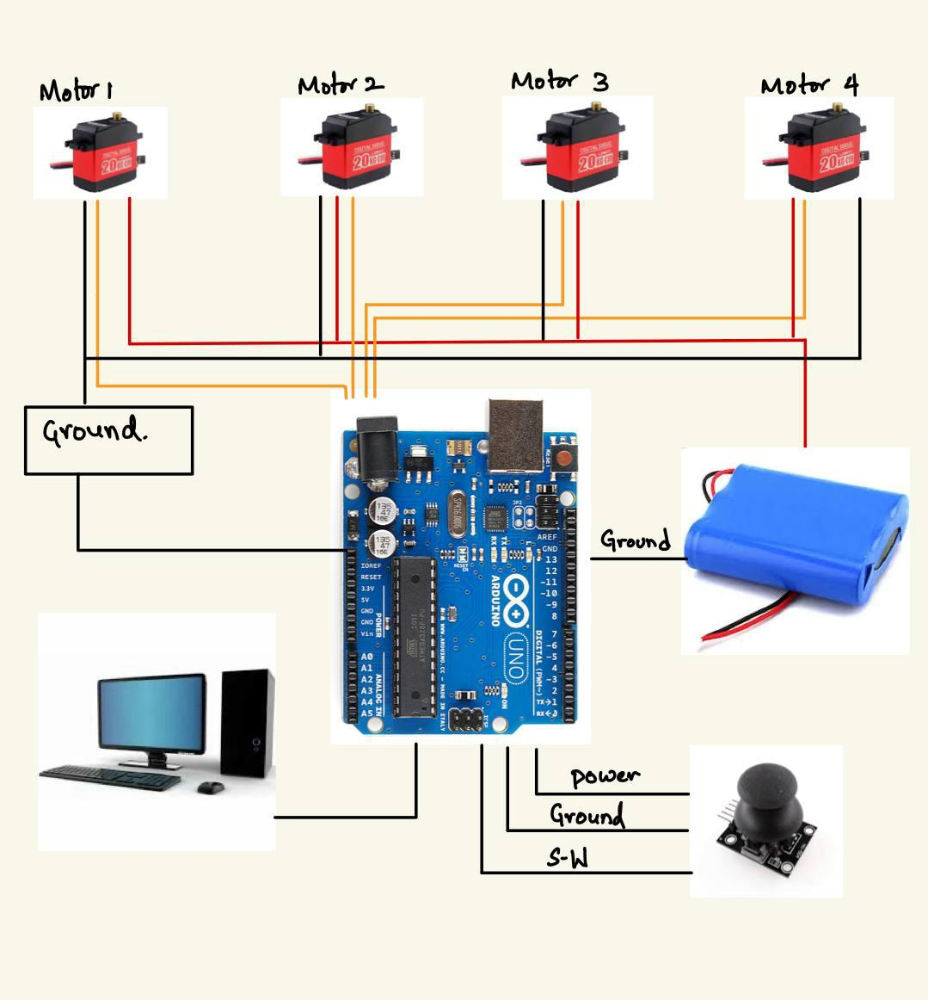

# Design and Fabrication of a 3-DOF Robotic Arm

**Author:** Rohan Aaron Indupally | Vasavi College of Engineering
**Project Type:** Semester Project (Project Work/Internship, Sem. VII)

---

## TL;DR

Designed, modeled, and physically fabricated a 3-DOF pick-and-place robotic arm from scratch, base rotation, shoulder, elbow, wrist, and a worm-gear gripper, controlled by an Arduino Uno running custom inverse kinematics. The arm reliably picks up and relocates objects up to ~300g with ±5mm repeatability and ±2° angular precision, using nothing but 5 servo motors, a joystick trigger button, and hand-derived IK equations running in real time on the microcontroller.

<p align="center">
  
</p>

---

## What It Does

The arm executes a fully automated pick-and-place cycle: press a button, and it rotates to a pickup location, computes the joint angles needed to reach a target (X, Y) coordinate using inverse kinematics, closes its gripper on the object, lifts, rotates to a drop-off point, and releases, all without any further human input.

**Full CAD assembly:**

<p align="center">
  
</p>

---

## Mechanical Design

Every component was modeled in SolidWorks and individually stress-tested before fabrication. The arm consists of 5 key parts: base, Link 1, Link 2, wrist, and a gripper with a worm-gear locking mechanism.

**Base** — a circular platform with a central hollow shaft for the base-rotation servo, mounting holes for chassis attachment, and cable-management cutouts. Center of mass was deliberately kept low for stability, and the design was validated in SolidWorks Simulation to withstand operational torque and load without deformation.

<p align="center">
  
</p>

**Links** — Link 1 (shoulder-to-elbow) is a 31cm hollow rectangular beam with ribs and fillets for strength-to-weight optimization, flanged at both ends for precise bolt-on connections. Stress analysis confirmed it could handle arm weight and payload without significant flexing.

**Gripper** — the standout mechanical feature: a worm-gear-driven gripper that holds objects firmly **without requiring continuous power**, improving energy efficiency and mechanical stability compared to a simple servo-held gripper.

<p align="center">
  
</p>

**Full workspace assembly**, including the object-pickup platform used for testing:

<p align="center">
  
</p>

---

## Torque Analysis

Before selecting servo motors, torque requirements at each joint were calculated by hand, modeling the arm as a cantilever beam and computing the effective mass and center-of-mass distance for each configuration.

<p align="center">
  <br>
  <em>Sample torque calculation for the shoulder motor, modeling downstream links and payload as a cantilevered mass.</em>
</p>

This analysis was extended across a full range of arm extensions and payload weights to confirm servo selection would hold up under worst-case loading:

<p align="center">
  <br>
  <em>Required torque vs. arm extension for payloads from 300g to 1000g — used to validate servo torque ratings against realistic operating conditions.</em>
</p>

Based on this analysis, high-torque **25kg-cm servos** were selected for the base and shoulder joints, where torque demand is highest:

<p align="center">
  
</p>

---

## Electronics

The full system runs on 5 PWM-controlled servo motors, an Arduino Uno, and a single push-button trigger (repurposed from a joystick module) to start the pick-and-place cycle.

<p align="center">
  
</p>

**Bill of materials:**
- Arduino Uno (core control unit)
- 5x servo motors (high-torque for base/shoulder, standard for wrist/gripper)
- Joystick module (repurposed for its push-button only)
- 12V battery pack with buck converter for regulated servo power
- Common ground shared across servos, Arduino, and battery

---

## Control: Inverse Kinematics

Rather than hard-coding joint angles for each task, the arm computes them in real time from target (X, Y) coordinates using a planar 2-link inverse kinematics solution:

```cpp
void computeAndMoveIK(float x, float y) {
  float dist = sqrt(x * x + y * y);
  if (dist > (L1 + L2)) {
    Serial.println("Target out of reach.");
    return;
  }
  float cosTheta2 = (x * x + y * y - L1 * L1 - L2 * L2) / (2 * L1 * L2);
  float theta2 = acos(cosTheta2);
  float k1 = L1 + L2 * cos(theta2);
  float k2 = L2 * sin(theta2);
  float theta1 = atan2(y, x) - atan2(k2, k1);
  float thetaWrist = -(theta1 + theta2);
  int angle1 = constrain(degrees(theta1), 0, 180);
  int angle2 = constrain(degrees(theta2), 0, 180);
  int angleWrist = constrain(degrees(thetaWrist), 0, 180);
  servoShoulder.write(angle1);
  delay(300);
  servoElbow.write(angle2);
  delay(300);
  servoWrist.write(angleWrist);
  delay(300);
}
```

The full pick-and-place sequence (base rotation → IK-driven approach → grip → lift → rotate → release) is orchestrated in a single `pickAndPlace()` function, triggered whenever the joystick button is pressed. See `code/Arduino_Inverse_Kinematics_Code.ino` for the complete program, and `code/Arduino_Test_Code.ino` for the simpler fixed-sequence calibration program used to validate servo wiring and range of motion before running full IK control.

---

## Results

**Mechanical & structural:**
- Smooth, vibration-free motion across all 5 joints with no observed backlash or misalignment
- Reliably handled payloads up to ~300g without deflection or servo strain
- 3D-printed PLA+ components showed no cracking or warping after repeated operation cycles

**Control & precision:**
- ±2° angular repeatability using PWM servo control
- ±5mm positioning repeatability across repeated pick-and-place cycles
- Stable power draw (~12V, 2A) with no overheating during extended operation

**Honest limitations:**
- Stability degraded at full arm extension with a payload, particularly at higher speeds — future iterations would benefit from added base weight or a clamping mechanism
- Fully open-loop control — no real-time feedback, so the system cannot detect or self-correct for servo backlash or external disturbances mid-motion

---

## Repository Contents

| File | Description |
|---|---|
| `code/Arduino_Inverse_Kinematics_Code.ino` | Full pick-and-place control program with real-time inverse kinematics |
| `code/Arduino_Test_Code.ino` | Simplified fixed-sequence test program for servo calibration and wiring validation |
| `Design_and_Fabrication_Report.pdf` | Complete written report — mechanical design, electronics, code, fabrication, and results |
| `images/` | CAD renders, mechanical component views, calculations, and the physical fabricated arm |
