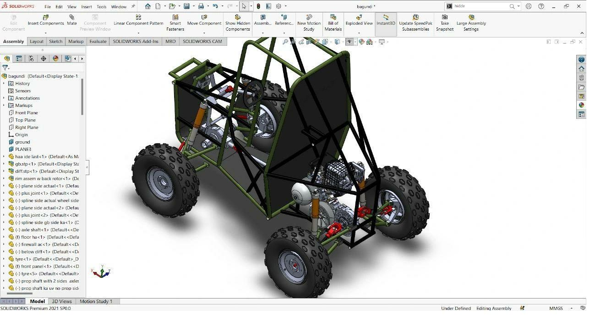
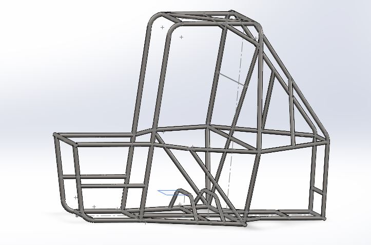
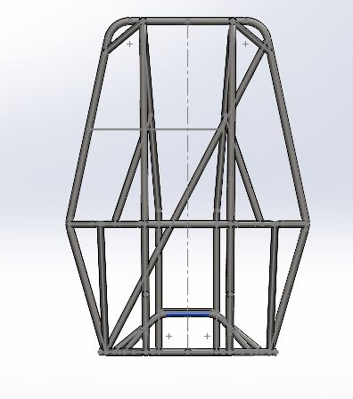
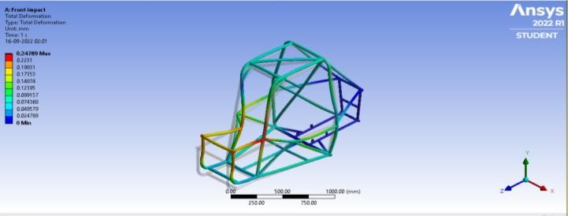
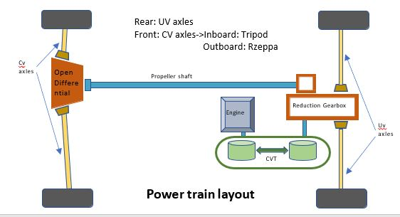
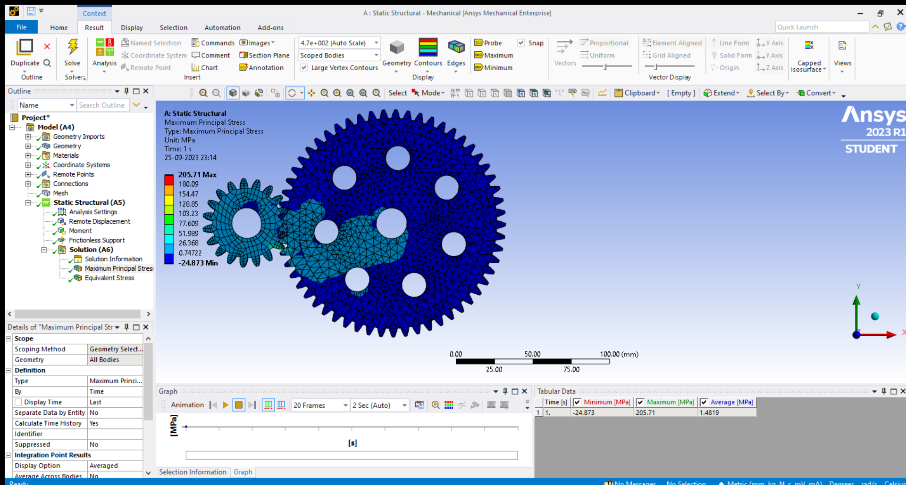
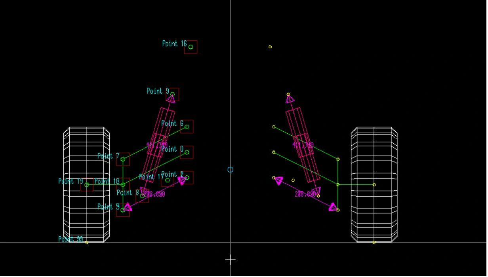
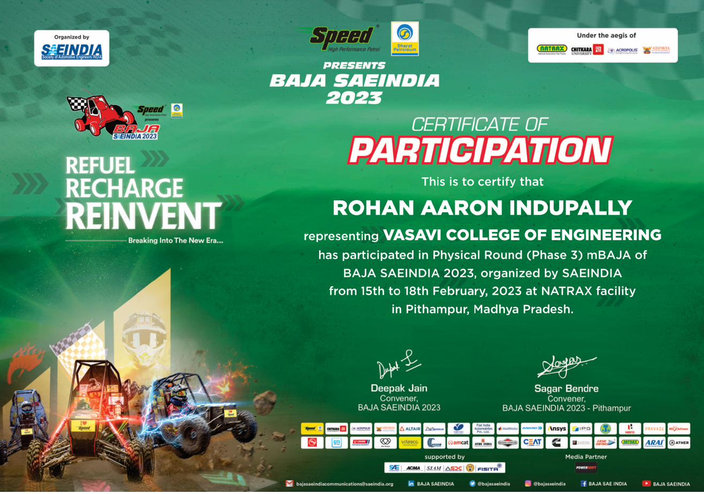

# Team Torque — All Terrain Vehicle (ATVC 2024)

**Team:** Team Torque, Vasavi College of Engineering
**Vehicle:** 24172 | **Competition:** ATVC 2024 | **Result:** 3rd Place, Design Evaluation (19th overall / 120 teams)

---

## TL;DR

Designed, fabricated, and competed with a full off-road all-terrain vehicle from the ground up — chassis, drivetrain, suspension, steering, and braking — for the SAE ATVC 2024 competition. The team converted from 2WD to a full-time **4WD system**, cut chassis weight from 27 kg to 25 kg while shrinking the footprint by over 25 cm in length, and validated every subsystem through hand calculations, Ansys FEA, and MSC Adams multibody dynamics before manufacturing. The vehicle placed **3rd in design evaluation out of 120 teams**. Prior to this, the team competed in **BAJA SAEINDIA 2023**, physically qualifying and racing at the NATRAX facility in Pithampur.

  

---

## Vehicle Overview

The vehicle is a unibody roll-cage design built around one clear priority: driver safety, without sacrificing performance on rough, unpredictable off-road terrain. Every subsystem was independently researched, designed, analyzed, and validated rather than copied from prior designs.

**Key upgrades from the previous vehicle iteration:**

| Specification | Old | New |
|---|---|---|
| Drive | 2WD | 4WD |
| Frame weight | 27 kg | 25.03 kg |
| Overall length | 2108.2 mm | 1832.35 mm |
| Overall width | 1489.6 mm | 966.79 mm |
| Steering mechanism | Ackermann | Anti-Ackermann |
| Steering ratio | 12:1 | 6.4:1 |
| Top speed | 53 kmph | 56 kmph |
| Max torque | 520 Nm | 524.20 Nm |
| Gradeability | 64% | 65% |

---

## Chassis

Designed as a "nose" configuration, front bracing members don't extend to the front bumper, dissipating impact forces away from the driver while improving side entry/exit clearance for emergencies. Built from **AISI 4130** chromoly steel tubing, chosen specifically for its strength-to-weight ratio, with primary members at 1.15" OD / 0.065" wall and secondary members at 1" OD. All joints were TIG welded for precision and weld strength, with filler rod selection matched to tube thickness and material at each joint.

<table>
<tr>
<td align="center"> <em>Isometric view</em></td>
<td align="center"> <em>Front view</em></td>
</tr>
</table>

**CAE validation across every major loading scenario:**

| Test | Force | Stress | Deformation | F.O.S |
|---|---|---|---|---|
| Front impact | 3G | 328.57 MPa | 10.36 mm | 1.4 |
| Side impact | 6G | 383.33 MPa | 10.82 mm | 1.2 |
| Rear impact | 3G | 262.85 MPa | 4.83 mm | 1.7 |
| Rollover | 3G | 393.16 MPa | 12.66 mm | 1.1 |
| Torsional | 1G | 255.55 MPa | 8.10 mm | 1.8 |
| Bump | 1G | 403.50 MPa | 13.61 mm | 1.1 |

   
  <em>Ansys Static Structural front-impact deformation analysis on the roll cage.</em>

---

## Drivetrain

The single biggest engineering change on this vehicle: converting from 2WD to a **full-time 4WD system**, sending power to all four wheels rather than just the rear. Built around the Briggs & Stratton engine (305cc, 9.1 HP @ 3600 RPM), power flows through a CVTech CVT (3:1 to 0.43:1 ratio range) into a custom two-stage reduction gearbox for the rear wheels (12:1 ratio, EN353 gears, AL6061 casing), with a bevel-gear-driven propeller shaft sending power forward to an open differential (12.75:1 ratio) for the front wheels.

**Why two different gear ratios front and rear?** The propeller shaft introduces power losses between the rear gearbox and front differential. Using a slightly higher ratio at the front (12.75:1 vs. 12:1 rear) compensates for that loss, ensuring both axles deliver equal torque to the ground — validated through hand-calculated tractive force and torque-balance equations, not just simulation.

Drive axles use UV joints at the rear (better articulation, higher ground clearance) and CV joints at the front (tripod inboard, Rzeppa outboard, reducing power losses while accommodating steering and suspension travel simultaneously).

   
  <em>Power train layout — engine and CVT feed the reduction gearbox, splitting power to the rear UV axles directly and to the front CV axles via propeller shaft and open differential.</em>

**Result:** 4WD max acceleration of 5.72 m/s², max torque of 524.20 Nm, and a calculated top speed of 52.24 km/hr under 4WD load, all validated against hand calculations before the vehicle was ever tested.

The reduction gearbox itself was designed using the Lewis-Buckingham equations, then validated in Ansys, sized against the weaker of the two mating gears in each stage:

   
  <em>Ansys structural analysis on the reduction gearbox gear stage, validating maximum principal stress against yield strength for the chosen EN353 gear material.</em>

---

## Suspension

Independent suspension throughout: **double wishbone (A-arms) up front**, **H-arms with a toe link at the rear**. The team explicitly considered and rejected a MacPherson strut front layout, since it offered less control over suspension geometry compared to the A-arm setup ultimately used.

All suspension arms (front A-arms and rear H-arms) are fabricated from AISI 4130, 1" OD, 0.078" wall. Knuckles and uprights use **EN24 steel**, chosen after direct comparison against EN8, AL6061, and AL7075, achieving a factor of safety of 1.9–2.1 depending on the component. Shock absorbers are **FOX Float 3 air shocks**, selected for adjustable high/low-speed compression and rebound damping.

  

<em>MSC Adams suspension kinematics analysis, used to validate geometry, roll center location, and motion ratio before fabrication.</em>

---

## Steering

Switched from a standard **Ackermann to an Anti-Ackermann** steering geometry this iteration, dropping the steering ratio from 12:1 to 6.4:1 and tightening the turning ratio from 2.3 to 1.7. The linkage was designed in **Adams**, then cross-validated in **Lotus** software alongside the suspension model to optimize caster and minimize bump steer, ensuring the steering and suspension systems work together rather than fighting each other through the wheel travel range.

---

## Braking

A fully self-designed and self-manufactured braking system, tuned to lock all four wheels simultaneously. Uses a **tandem master cylinder** (replacing a two-master-cylinder setup from prior iterations, for compactness) feeding independent front/rear hydraulic circuits. The rear brakes are **inboard**, mounted directly to the drive shaft rather than at the wheel, meaningfully reducing unsprung mass and improving how the suspension performs over rough terrain.

Braking discs (180 mm front, 220 mm rear) were custom-designed in-house rather than bought off the shelf, balancing weight, strength, and cost.

---

## Body

A layered protection strategy: **0.039" aluminum skid plates** protect the underside from debris and impact, a **0.019" aluminum firewall** separates the driver from the engine bay (also routing seat belts safely through the rear roll hoop), and **poly-acrylic body panels** shield the driver from mud and light debris without extending high enough to block visibility during technical sections like rock crawls.

---

## Design Validation & Process

Every subsystem went through the same rigor: **hand calculations first, then simulation (Ansys FEA for structural components, MSC Adams and Lotus for kinematics), then physical validation** (PVC mockups for ergonomics, drop tests for suspension, destructive testing for welds). A full **DFMEA** (Design Failure Mode and Effects Analysis) was conducted across every major subsystem, systematically identifying failure modes, root causes, and design controls, then re-scoring risk after corrective action was applied.

Roll cage ergonomics specifically followed a 6-stage process: rulebook clearance research, review of prior team failures, CAD drafting, PVC mockup verification, analysis/optimization, and final design validation, ensuring the frame fit the 95th-percentile male driver comfortably while satisfying every rulebook constraint.

---

## Cost & Weight

Total build cost: **₹4,19,911.40**, total vehicle weight: **142.4 kg**, broken down by subsystem (suspension, braking, steering, frame, transmission, wheels, and miscellaneous), with individual component-level costing tracked throughout development to support design tradeoff decisions.

---

## Prior Competition: BAJA SAEINDIA 2023

Before this vehicle, the team competed in **BAJA SAEINDIA 2023**, physically qualifying through to Phase 3 and racing at the **NATRAX facility in Pithampur, Madhya Pradesh** (Feb 15–18, 2023). That vehicle's post-competition lessons learned, reduced triangulation improving strength-to-weight ratio by 80%, better suspension clamp lengths, and more jigs/fixtures to cut manufacturing error, directly informed several of the design decisions carried into the 2024 vehicle.

  

---

## Lessons Learned

- Manufacturing precision matters as much as design: several issues traced back to machining abrasion rather than design flaws, addressed by building more jigs and fixtures for the next iteration
- More dedicated testing time was needed before competition to catch issues earlier
- Cross-domain coordination (chassis, suspension, drivetrain, steering teams working in parallel) required tighter integration checks to avoid late-stage surprises

---

## Repository Contents

| File | Description |
|---|---|
| `TeamTorque_ATVC2024_DesignPresentation.pptx` | Full design review presentation — CAE results, DFMEA, cost analysis, validation plan |
| `Copy_of_24172_TeamTorque_Design_Report_1.pdf` | Complete written design report covering every subsystem |
| `Prelims_2023-24.pptx` | Prior-year (BAJA SAEINDIA 2023) design and lessons-learned presentation |
| `images/` | CAD renders, kinematics analysis, and competition documentation |

**Team Contact:** I. Rohan Aaron — Team Head
